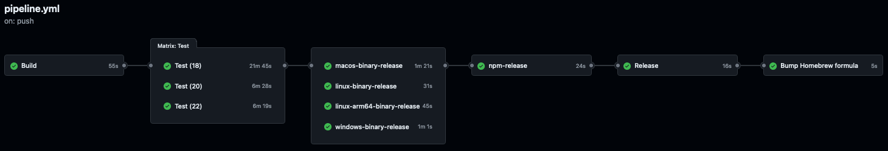

# Frodo CLI Release Pipeline

The Frodo CLI project uses an automated release pipeline defined in [../.github/workflows/pipeline.yml](../.github/workflows/pipeline.yml).



## Release Model

### Triggers

The workflow runs on:

- Pull requests to `main` (build/test/packaging validation)
- Pushes to `main` (automated prerelease flow)
- Manual `workflow_dispatch` (explicit release type selection)

### Release Type Selection

Release type resolution is:

- `workflow_dispatch` on `main`: use selected input (`prerelease`, `patch`, `minor`, `major`)
- all other runs: `prerelease`

There is no PR-label-based release-type logic.

## Pipeline Jobs

### Build

Build does the following:

- Uses deep checkout with tags (`fetch-depth: 0`, `fetch-tags: true`)
- Guards against version drift from latest npm/tagged release
- Resolves release type
- Computes next version with `vscheuber/version-bump-action@v1`
- Guards against duplicate tag/version
- Updates manifests with `vscheuber/manifest-version-update-action@v1`
- Builds CLI artifact and publishes build outputs for downstream jobs

### Test

Runs test matrix across Node versions, plus direct and proxy integration tests when secrets are available.

### Binary Release Jobs

The pipeline builds, smoke-tests, and archives binaries for:

- `linux-x64`
- `linux-arm64`
- `macos-intel`
- `macos-arm64`
- `windows-x64`

### npm-release

`npm-release` runs after binary jobs and uses trusted publishing via `vscheuber/npm-trusted-publish-action@v1`.

For stable release types (`patch`, `minor`, `major`), it performs dual publish:

- Publishes companion prerelease `x.y.z-n` to `next`
- Publishes stable `x.y.z` to `latest`

For `prerelease`, it publishes to `next`.

### Release

Release job:

- Downloads binary artifacts
- Generates changelog/release notes using `vscheuber/ai-changelog-action@v1`
- Commits changelog and manifest updates
- Creates GitHub release with platform artifacts

Release assets include:

- [../CHANGELOG.md](../CHANGELOG.md)
- [../LICENSE](../LICENSE)
- `Release.txt`
- `frodo-linux-x64-<version>.zip`
- `frodo-linux-arm64-<version>.zip`
- `frodo-macos-intel-<version>.zip`
- `frodo-macos-arm64-<version>.zip`
- `frodo-windows-x64-<version>.zip`

### Homebrew Formula Update

After successful release + npm publish, the workflow updates Homebrew tap formulas (`frodo-cli` and `frodo-cli-next`).

## Pipeline Maintenance

Pipeline behavior in forks can differ due to missing secrets/permissions. Validate release behavior in the main repository before relying on fork runs for release-path testing.

## Recovering From A Bad Release

If a bad release occurs:

1. Delete the incorrect GitHub release.
2. Revert release changes in [../CHANGELOG.md](../CHANGELOG.md), [../package.json](../package.json), and [../package-lock.json](../package-lock.json).
3. Merge the corrective PR.
4. Remove incorrect npm version if necessary:

   ```console
   npm unpublish @rockcarver/frodo-cli@<version>
   ```

5. Remove incorrect tag if needed:

   ```console
   git push --delete origin v<version>
   ```

6. Re-run release with the intended release type via `workflow_dispatch`.
