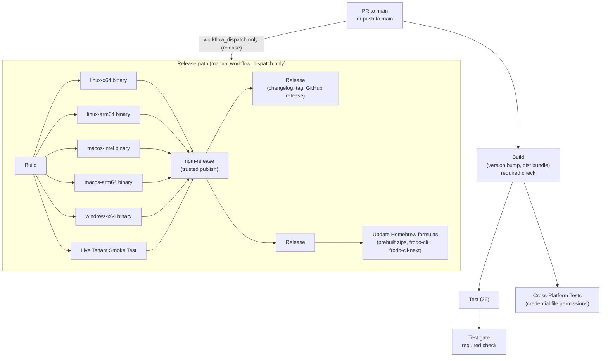

# Frodo CLI Release Pipeline

The Frodo CLI project uses an automated release pipeline defined in [../.github/workflows/pipeline.yml](../.github/workflows/pipeline.yml).

For the tools underneath the pipeline — bundler, binary packaging (native
Node.js SEA), macOS signing and notarization, Dependabot auto-merge, and the
maintenance history of the build environment — see [BUILD-ENV.md](BUILD-ENV.md).

The pipeline diagram below is rendered by GitHub from the Mermaid source in
this file — it updates with the workflow itself and never goes stale like a
screenshot. (In renderers without Mermaid support, the same layout is
described in the job sections that follow.)


```mermaid
flowchart TD
    PR["PR to main<br/>or push to main"] --> B["Build<br/>(version bump, dist bundle)<br/>required check"]
    B --> T["Test (26)"]
    B --> X["Cross-Platform Tests<br/>(credential file permissions)"]
    T --> TG["Test gate<br/>required check"]
    PR -->|"workflow_dispatch only (release)"| RELPATH["Release path"]

    subgraph RELPATH ["Release path (manual workflow_dispatch only)"]
        B2["Build"] --> TL["Live Tenant Smoke Test"]
        B2 --> LX["linux-x64 binary"]
        B2 --> LA["linux-arm64 binary"]
        B2 --> MI["macos-intel binary"]
        B2 --> MA["macos-arm64 binary"]
        B2 --> WI["windows-x64 binary"]
        LX & LA & MI & MA & WI --> NR["npm-release<br/>(trusted publish)"]
        TL --> NR
        NR --> R["Release<br/>(changelog, tag, GitHub release)"]
        R2["Release"] --> HB["Update Homebrew formulas<br/>(prebuilt zips, frodo-cli + frodo-cli-next)"]
        NR --> R2
    end
```

## Release Model

### Triggers

The workflow runs on:

- **Pull requests to `main`** — validation only: Build, the Node test matrix,
  cross-platform tests, and the linux-x64 binary build (it needs no secrets,
  so PRs exercise the whole binary path). Release jobs are skipped.
- **Pushes to `main`** — the same validation, plus the Live Tenant Smoke
  Test. No publishing, no release.
- **Manual `workflow_dispatch`** — the full release path with the release
  type as an explicit input: `prerelease` | `premajor` | `patch` | `minor`
  | `major` (with a `dry-run` flag that stops short of publishing/tagging).
  `premajor` starts (or continues) an `X.0.0-1` prerelease train for the
  next major.

All releases are manual. There is no PR-label-based release-type logic.

### Branch protection

The `main-branch-protection` ruleset requires three checks before anything
merges to `main`:

- `Build`
- `Test gate`
- `linux-x64-binary-release`

Release bot commits to `main` (changelog/version updates) are covered by the
ruleset's bypass: the Release job authenticates with the org-wide
`FRODO_CI_PAT` fine-grained token (repository admin identity), whose pushes
the admin bypass admits. The GitHub Actions app cannot be a bypass actor —
`GITHUB_TOKEN` pushes to `main` are rejected by the required status checks.

## Pipeline Jobs

### Build

- Uses deep checkout with tags (`fetch-depth: 0`, `fetch-tags: true`)
- Guards against version drift from the latest npm/tagged release
- Resolves the release type; computes the next version with
  `vscheuber/version-bump-action@v1`; guards against duplicate tag/version
- Updates manifests with `vscheuber/manifest-version-update-action@v1`
- Runs the MCP SDK track check, the npm bundle build (`tsdown` + `tsc`),
  `npm run check` (ESLint 10 + Prettier, including import order — see
  [BUILD-ENV.md](BUILD-ENV.md) §5), and a critical-level security audit
- Uploads `package.json`, `package-lock.json` and `dist/` as the `build`
  artifact that every downstream job consumes

Runs on Node 24 (the npm support floor; the Build job only produces the npm
bundle). Note this job intentionally does NOT build the SEA binary — that
requires Node 26 and is the binary jobs' product (see
[BUILD-ENV.md](BUILD-ENV.md) §6). The Test job pins Node 26 and runs the
suite against the SEA binary itself.

### Test

- **Test (26)**: the full jest suite (≈632 suites, ≈1,950 tests,
  ≈8,500 snapshots) serially, on Node 26 — the version the shipped SEA
  binary embeds, and the only one the CLI supports (engines ≥26 since
  #741). frodo-lib keeps the full 22/24/26 matrix in its own pipeline.
  Uses Python 3.11 for the PTY-based shell tests. The suite runs against
  the freshly built SEA binary (pinned via `tools/with-frodo-bin.mjs`), not
  an npm install.
- **Live Tenant Smoke Test** (push/release only): runs against a real
  tenant using service credentials (`FRODO_SA_ID`/`FRODO_SA_JWK`), through a
  squid proxy service container.
- **Cross-Platform Tests (Credential File Permissions)**: verifies the CLI
  creates credential files with restrictive permissions on Windows, macOS
  and Linux.

### Test gate

`Test gate` is a tiny aggregator job that runs after the `Test` matrix and
fails if **any** matrix leg failed. It exists because of how branch
protection works: the ruleset must name required checks exactly, and the
required-check name of a matrix job includes its matrix value
(`Test (22)`, `Test (26)` …). If the ruleset named those directly, every
Node version added or retired would require a ruleset edit. Instead the
ruleset requires the single, stable name `Test gate`, whose outcome is
derived from the whole matrix — so the Node version list can change freely
without ever touching repository settings.

The job uses `if: ${{ !cancelled() }}` so it still runs (and fails) when a
matrix leg is cancelled or skipped, which a plain `needs` alone would
silently accept.

### Binary Release Jobs

All five build a native [SEA binary](BUILD-ENV.md) with `node --build-sea`
(Node 26), smoke-test it (`-v`, `journey -h`, `journey export -h`), and
archive a per-platform zip named `frodo-<os>-<arch>-<version>.zip`:

- `linux-x64` — native build on `ubuntu-24.04`. **Runs on PRs** (no secrets
  needed) and is the required binary check.
- `linux-arm64` — native build on the `ubuntu-24.04-arm` runner (SEA needs
  glibc; containers/alpine are not used).
- `macos-arm64` — native build on `macos-15`; signed with the Developer ID
  certificate (`--options runtime`, `allow-jit` entitlements) and notarized.
- `macos-intel` — **cross-built on the arm64 runner**: the SEA config's
  `executable` field points at the official darwin-x64 Node binary, and the
  result is smoke-tested under Rosetta on the runner. This retired the
  `macos-15-intel` runner (GitHub retires it Aug 2027).
- `windows-x64` — native build on `windows-2022`; `frodo` is copied to
  `frodo.exe`; unsigned (unchanged policy).

macOS binaries are signed **immediately after** `--build-sea` (its output is
unsigned) and the ditto zip is notarized with `xcrun notarytool submit
--wait` before upload.

### npm-release

`npm-release` runs for manual release executions and uses trusted publishing
via `vscheuber/npm-trusted-publish-action@v1`. It deliberately runs **last**
among the publish-adjacent jobs (comment in the workflow: unpublishing npm
releases is inconvenient), after all binary jobs.

For stable release types (`patch`, `minor`, `major`), it performs dual
publish:

- Publishes companion prerelease `x.y.z-n` to `next`
- Publishes stable `x.y.z` to `latest`

For `prerelease`, it publishes to `next`.

### Release

Release job (needs build, live smoke, all five binary jobs):

- Generates changelog/release notes using `vscheuber/ai-changelog-action@v1`
- Commits changelog and manifest updates to `main` (pushed as the
  `FRODO_CI_PAT` identity — the repository admin the ruleset's bypass
  covers; a plain `GITHUB_TOKEN` push would be rejected by the required
  status checks, since the Actions app cannot be a bypass actor)
- Creates the GitHub release with platform artifacts

Release assets include:

- [../CHANGELOG.md](../CHANGELOG.md)
- [../LICENSE](../LICENSE)
- `Release.txt`
- `frodo-linux-x64-<version>.zip`
- `frodo-linux-arm64-<version>.zip`
- `frodo-macos-intel-<version>.zip`
- `frodo-macos-arm64-<version>.zip`
- `frodo-windows-x64-<version>.zip`

### Update Homebrew formulas

After a successful release + npm publish, the `homebrew-formula-update` job
regenerates the Homebrew tap formulas (`frodo-cli` and `frodo-cli-next`) and
pushes them to `rockcarver/homebrew-frodo-cli` (via the org-wide
`FRODO_CI_PAT` PAT — the same fine-grained token (Contents: read/write on
`frodo-cli`, `frodo-lib`, `homebrew-frodo-cli`, stored as an organization
secret with selected-repository visibility) that the Release jobs use to
push their release commits).

The formulas install **prebuilt release binaries** (not source builds):
each formula carries per-OS/arch `url` + `sha256` blocks pointing at the
release zips (`frodo-macos-arm64` / `frodo-macos-intel` /
`frodo-linux-arm64` / `frodo-linux-x64`), so `brew install` hands the user
the exact CI-tested, Developer ID-signed, notarized binary — no local
Node.js toolchain needed. Both formulas are regenerated on every release
from `tools/update-homebrew-formula.mjs`, which downloads each zip to
compute its sha256 (the same bytes brew will download, so the pin is
verified twice) and skips the tap commit if nothing changed. The stable and
next formulas differ only in their install-time collision guard (stable
refuses to clobber an installed `frodo-cli-next` pre-release and vice
versa) — both install a binary named `frodo`.

## Pipeline Maintenance

Pipeline behavior in forks can differ due to missing secrets/permissions. Validate release behavior in the main repository before relying on fork runs for release-path testing.

Keep this document in sync with `pipeline.yml` — including the Mermaid
diagram — as part of any pipeline change (same convention as
[BUILD-ENV.md](BUILD-ENV.md)).

## Recovering From A Bad Release

If a bad release occurs:

1. Delete the incorrect GitHub release.
2. Revert release changes in [../CHANGELOG.md](../CHANGELOG.md), [../package.json](../package.json), and [../package-lock.json](../package-lock.json).
3. Merge the corrective PR.
4. Remove incorrect npm version if necessary:

   ```console
   npm unpublish @rockcarver/frodo-cli@<version>
   ```

5. Remove incorrect tag if needed:

   ```console
   git push --delete origin v<version>
   ```

6. Re-run release with the intended release type via `workflow_dispatch`.
